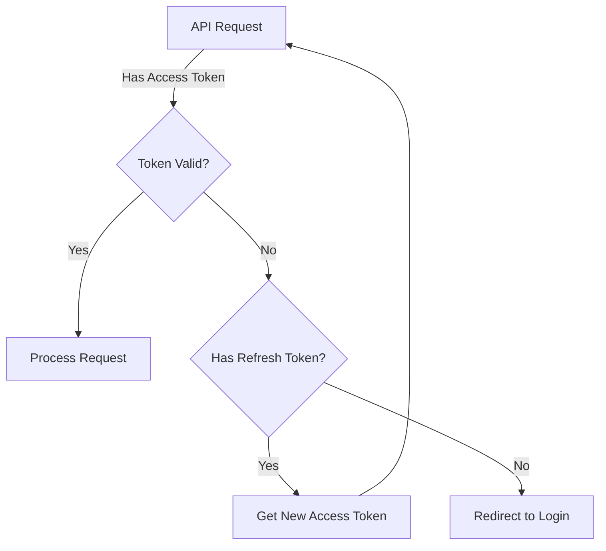
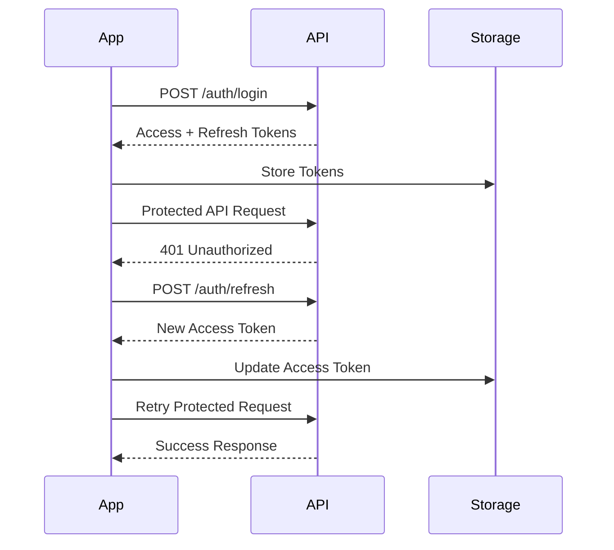

# Authentication Flow Documentation

## Available Authentication APIs

### 1. User Registration
```http
POST /api/auth/register
Content-Type: application/json

Request Body:
{
    "phone": string,     // Phone number with country code
    "password": string,  // Password (will be hashed)
    "name": string      // User's full name
}

Response (201):
{
    "userId": string,
    "phone": string,
    "name": string
}
```

### 2. Login
```http
POST /api/auth/login
Content-Type: application/json

Request Body:
{
    "phone": string,
    "password": string
}

Response (200):
{
    "accessToken": string,  // JWT token for API access
    "refreshToken": string, // JWT token for getting new access tokens
    "user": {
        "userId": string,
        "phone": string,
        "name": string
    }
}
```

### 3. Refresh Token
```http
POST /api/auth/refresh
Content-Type: application/json

Request Body:
{
    "refreshToken": string
}

Response (200):
{
    "accessToken": string,
    "refreshToken": string
}
```

### 4. Logout
```http
POST /api/auth/logout
Authorization: Bearer {accessToken}

Response (200):
{
    "message": "Logged out successfully"
}
```

## Authentication Flow Details

### 1. Token Management
- Access tokens expire in 15 minutes
- Refresh tokens expire in 30 days
- All protected APIs require `Authorization: Bearer {accessToken}` header

### 2. Error Handling
```typescript
Error Responses:
- 400 Bad Request: Invalid input data
- 401 Unauthorized: Invalid/expired token
- 409 Conflict: Phone number already registered
- 500 Internal Server Error

Error Format:
{
    "error": string,    // Error code
    "message": string,  // Human-readable message
    "details"?: object  // Optional additional details
}

Error Codes:
- INVALID_CREDENTIALS
- INVALID_TOKEN
- TOKEN_EXPIRED
- UNAUTHORIZED
- DUPLICATE_PHONE
- INVALID_INPUT
```

### 3. Protected API Access Flow


### 4. Security Features
- Password hashing using bcrypt
- JWT-based authentication
- Token blacklisting on logout
- Rate limiting on auth endpoints
- Input validation using Zod

## Implementation Requirements for Flutter

### 1. Secure Storage
- Need secure storage for tokens
- Store both access and refresh tokens
- Clear tokens on logout

### 2. Token Management
- Intercept 401 responses
- Auto-refresh access token
- Retry failed requests
- Handle token expiration

### 3. API Client
- Handle authentication headers
- Manage token refresh
- Error handling and parsing
- Request retry logic

### 4. State Management
- Track authentication state
- Store user information
- Handle login/logout transitions

### 5. Input Validation
- Phone number format validation
- Password strength requirements
- Error message handling

## Example Authentication Flow



## Implementation Tips

### Flutter Secure Storage
```dart
// Store tokens
await storage.write(key: 'access_token', value: token);
await storage.write(key: 'refresh_token', value: refreshToken);

// Retrieve tokens
final token = await storage.read(key: 'access_token');
final refreshToken = await storage.read(key: 'refresh_token');

// Clear tokens on logout
await storage.deleteAll();
```

### API Client Configuration
```dart
// Add auth header interceptor
dio.interceptors.add(InterceptorsWrapper(
  onRequest: (options, handler) {
    final token = await getToken();
    options.headers['Authorization'] = 'Bearer $token';
    return handler.next(options);
  },
  onError: (error, handler) async {
    if (error.response?.statusCode == 401) {
      // Handle token refresh
      final newToken = await refreshToken();
      error.requestOptions.headers['Authorization'] = 'Bearer $newToken';
      // Retry original request
      return handler.resolve(await dio.fetch(error.requestOptions));
    }
    return handler.next(error);
  },
));
```

### Error Handling
```dart
try {
  final response = await dio.post('/auth/login', data: {
    'phone': phone,
    'password': password,
  });
  // Handle successful response
} on DioError catch (e) {
  if (e.response?.statusCode == 400) {
    // Handle validation errors
  } else if (e.response?.statusCode == 401) {
    // Handle authentication errors
  } else {
    // Handle other errors
  }
}
```

### State Management Example (using Provider)
```dart
class AuthState extends ChangeNotifier {
  User? _user;
  bool get isAuthenticated => _user != null;

  Future<void> login(String phone, String password) async {
    // Implement login logic
    notifyListeners();
  }

  Future<void> logout() async {
    // Implement logout logic
    notifyListeners();
  }
}
```

## Testing the Authentication Flow

1. **Registration Flow**
    - Attempt registration with valid data
    - Verify duplicate phone number handling
    - Test password validation
    - Verify successful registration response

2. **Login Flow**
    - Test valid credentials
    - Test invalid credentials
    - Verify token storage
    - Test automatic token refresh

3. **Protected API Access**
    - Test authenticated requests
    - Verify token expiration handling
    - Test refresh token flow
    - Verify logout behavior

4. **Error Scenarios**
    - Network errors
    - Invalid tokens
    - Server errors
    - Validation errors